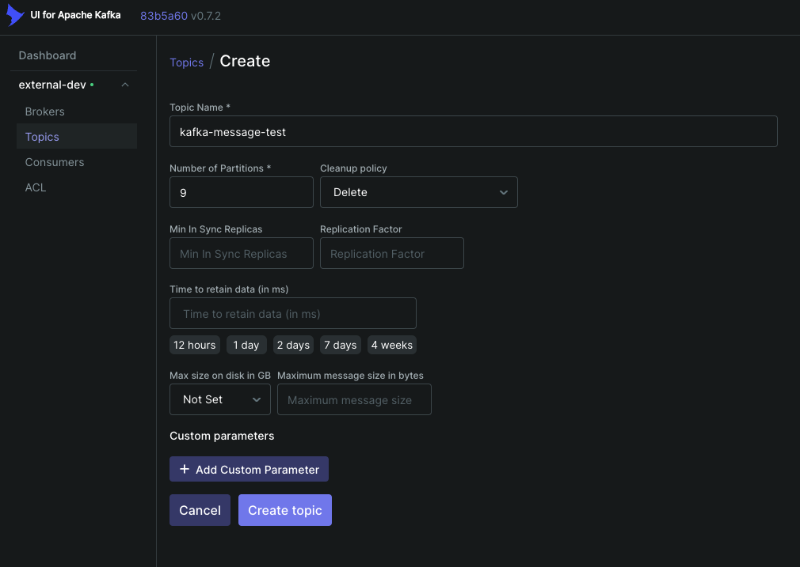

# aws-msk-example
A small example on how to use Kafka in AWS MSK.

### Create Docker Image for Kafka-UI

For detailed instructions, refer to the [original Confluence page](https://ailylabs.atlassian.net/wiki/spaces/AIL/pages/1953857723/External+async+communication+Kafka). Below are the steps to create and run a local Docker image for Kafka-UI:

**Note:** Adapt the following code to `dev` or `prod`accordingly.

1. Build the Docker image using the `kafka-ui-dockerfile.txt`:
    ```sh
    docker build -t kafkaui:local . -f kafka-ui-dockerfile.txt
    ```

2. Run the Docker container manually or using Docker Desktop:
    ```sh
    docker run -p 8080:8080 -d kafkaui:local
    ```

### Create a Topic in Kafka-UI

Creating a topic in Kafka-UI is straightforward. For simple topics, assign a name and the number of partitions. By default, we use 9 partitions.

<table>
<tr>
  <td>
    
  </td>
</tr>
</table>

### Install Python Packages

1. Create a `poetry.toml` file with the following content:
    ```toml
    [virtualenvs]
    in-project = true
    ```

2. Initialize the Python environment:
    ```sh
    poetry init --python ">=3.10.6,<3.11"
    ```

3. Add Cloudsmith to access Aily packages:
    ```sh
    poetry source add cloudsmith https://dl.cloudsmith.io/PRBlnvv3GHFM3KDl/ailylabs/pip/python/simple/
    ```

4. Add the required libraries:
    ```sh
    poetry add aily-py-commons
    poetry add aily-ai-brain
    poetry add jupyter
    poetry add confluent-kafka
    ```

### Run Example

There are two notebooks: one for the consumer and one for the producer. Execute the consumer notebook, followed by the producer notebook. 
* The consumer will print any received messages.
* The producer will send a simple "Hello Kafka" message.
